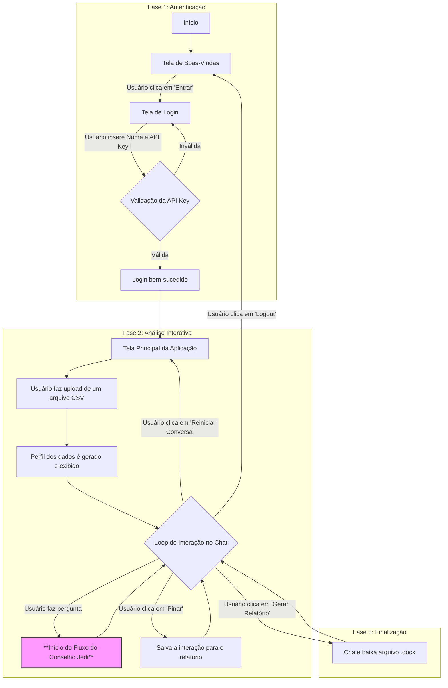

# ✨ JEDI: João's Exploratory Data Insight

## 🚀 Visão Geral do Projeto

Bem-vindo à nova era do **JEDI: João's Exploratory Data Insight**! Este não é apenas um sistema de chat, mas um ecossistema de agentes de IA trabalhando em harmonia, inspirado na sabedoria e especialização do Conselho Jedi de Star Wars.

O JEDI transforma a Análise Exploratória de Dados (EDA) em uma conversa colaborativa e inteligente. Em vez de um único agente, o sistema agora opera com um **Conselho Jedi**, onde um Mestre Orquestrador delega tarefas a agentes especialistas, garantindo respostas mais rápidas, robustas e perspicazes.

Com o novo JEDI, você pode:
*   **Conversar com um Conselho de Especialistas:** Cada pergunta é analisada e direcionada ao agente mais qualificado.
*   **Receber Orientação de um Mestre:** O agente Mestre atua como um consultor de dados, fazendo perguntas de esclarecimento e sugerindo melhores abordagens para sua análise.
*   **Obter Visualizações de Alta Qualidade:** Gráficos estáticos e esteticamente agradáveis são gerados com a biblioteca Seaborn, prontos para seus relatórios.
*   **Auditar o Processo de Decisão:** Ative o "Diário de Bordo" para ver o processo de pensamento do Conselho, desde a decisão do Mestre até a execução detalhada dos especialistas.

## 🌟 Funcionalidades Principais

*   **Arquitetura Multi-Agente "Conselho Jedi":**
    *   **Mestre Orquestrador:** O cérebro do conselho. Ele classifica a intenção do usuário, delega tarefas e atua como um consultor de dados. Para garantir a precisão, o Mestre agora utiliza uma lógica de **curto-circuito**: ele primeiro verifica a pergunta do usuário em busca de palavras-chave explícitas de análise ou visualização. Se encontradas, ele aciona o especialista correto imediatamente, tornando a seleção de ferramentas mais rápida e confiável. Apenas se nenhuma palavra-chave for detectada, ele utiliza o LLM para uma classificação de intenção mais ampla.
    *   **Guardião de Dados (🛡️):** O especialista técnico em `pandas`. Executa cálculos, análises e manipulações de dados de forma bruta e precisa.
    *   **Sábio Cônsul (📜):** O intérprete e contador de histórias. Transforma dados e resultados brutos em insights e explicações em linguagem natural.
    *   **Artesão Estático (🖼️):** O mestre das visualizações. Cria gráficos de alta qualidade com `Seaborn` para facilitar a compreensão e a comunicação.

### Fluxo da Aplicação (Jornada do Usuário)

O diagrama abaixo mostra a jornada completa do usuário na aplicação JEDI.



### Fluxo do Conselho Jedi (Lógica Interna)

Este fluxograma detalha o processo de decisão dos agentes a cada pergunta, destacando a arquitetura híbrida.


*   **Interface Intuitiva com Streamlit:** Mantém a facilidade de uso com upload de CSV, seleção de modelos e uma interface de chat interativa.
*   **Geração de Relatórios (`.docx`):** A funcionalidade de pinar descobertas e gerar um relatório foi mantida e aprimorada, agora compatível com os novos gráficos estáticos.
*   **Diário de Bordo para Auditoria:** Uma visão transparente do processo de decisão do Conselho, opcionalmente exibida na interface.
*   **Controles de Sessão:** Botões para "Logout" e "Reiniciar Conversa", permitindo um gerenciamento de sessão limpo e eficiente.

## 📂 Estrutura do Projeto

A estrutura foi expandida para acomodar o Conselho Jedi:

```
.
├── agents/                 # O Conselho Jedi! Lógica dos agentes.
│   ├── __init__.py
│   ├── artisan.py          # O Artesão (Seaborn)
│   ├── guardian.py         # O Guardião (Pandas)
│   ├── master.py           # O Mestre Orquestrador
│   └── sage.py             # O Sábio (Intérprete)
├── views/                  # Módulos da interface (páginas)
│   ├── login.py
│   ├── main_app.py
│   └── welcome.py
├── .streamlit/
├── asset/
├── utils.py
├── app.py
├── requirements.txt
└── README.md
```

## 🛠️ Como Usar

(As seções de Pré-requisitos, Instalação e Execução permanecem as mesmas da versão anterior.)

### Uso Básico

1.  **Login:** Autentique-se com seu nome e API Key do Google Gemini.
2.  **Análise:**
    *   Faça o upload de um arquivo CSV.
    *   Faça uma pergunta. Tente ser vago, como `"me mostre a distribuição"`, para ver o Mestre Jedi pedir esclarecimentos!
    *   Ou peça um gráfico diretamente: `"crie um histograma da coluna 'Amount' com seaborn"`.
    *   Ative a opção "Mostrar pensamentos do agente" na seção "Developer" para ver o Diário de Bordo completo.
    *   Use o botão "Pinar" (🧷) para salvar os insights mais importantes e gerar seu relatório.

## 👨‍💻 Desenvolvedor

**João Paulo Cardoso**
*   **LinkedIn:** [https://www.linkedin.com/in/joao-paulo-cardoso/](https://www.linkedin.com/in/joao-paulo-cardoso/)
*   **GitHub do Projeto:** [https://github.com/jpscard/JEDI](https://github.com/jpscard/JEDI)

---
*Refatorado e documentado com a ajuda de um assistente de IA.*
